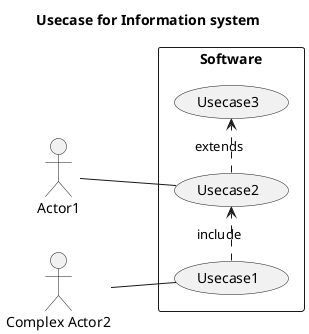

# Лабораторна робота №3 - Статус виконання

**Предмет:** Технології створення програмних продуктів  
**Викладач:** Олександр А. Блажко  
**Дата виконання:** 13.05.2026

---

## ✅ ВИКОНАНО

### 1. Налаштування структури каталогів

Створено повну структуру каталогів відповідно до вимог лабораторної роботи:

```
project_root/
├── 1.2.3-UseCaseDiagram/
│   ├── README.md ✅
│   └── UML-UseCase.puml ✅
├── 1.4.1-SoftwareArchitectConcept/
│   ├── README.md ✅
│   └── UML-Deployment.puml ✅
├── 2-SoftwareDesign/
│   ├── 2.1-UMLConceptClasses/
│   │   ├── README.md ✅
│   │   └── UML-ConceptClasses.puml ✅
│   ├── 2.2-AttributeVocabulary/
│   │   └── README.md ✅ (словник атрибутів)
│   └── 2.3-DataModel/
│       ├── README.md ✅
│       ├── RelModelSchema.puml ✅
│       └── JSONSchema.puml ✅
├── sql/
│   ├── schema.sql (приклад)
│   └── PersonTeacherStudentSchema.sql ✅ (нова SQL схема)
└── README.md ✅ (оновлено)
```

### 2. UML діаграми в PlantUML

#### 2.1 UML-UseCase.puml
**Статус:** ✅ Завершено

Діаграма прецедентів включає:
- Actor1 та Complex Actor2
- Usecase1, Usecase2, Usecase3
- Зв'язки: include, extends



#### 2.2 UML-Deployment.puml
**Статус:** ✅ Завершено

Діаграма розгортання показує архітектуру:
- Desktop 1 (Windows/Linux) з Web Browser
- Server 1 (Linux) з Web Server
- Пристрої введення (Keyboard, Mouse)

#### 2.3 UML-ConceptClasses.puml
**Статус:** ✅ Завершено

Концептуальна модель класів:
```
Person (базовий клас)
├── Teacher (успадковує Person)
│   ├── course: String
│   ├── workExperience: int
│   └── teaches 1:M Students
└── Student (успадковує Person)
    ├── course: String
    ├── studentGroup: String
    └── studies 1:1 Teacher
```

### 3. Логічне проектування

#### 3.1 Реляційна модель (RelModelSchema.puml)
**Статус:** ✅ Завершено

Схема з трьома таблицями:
- `person` (PK: person_id)
- `teacher` (PK: teacher_id, FK: person_id)
- `student` (PK: student_id, FK: person_id, FK: teacher_id)

#### 3.2 JSON модель (JSONSchema.puml)
**Статус:** ✅ Завершено

JSON Schema для структури даних:
```json
{
  "persons": [{"id", "name", "age"}],
  "teachers": [{"id", "personId", "course", "workExperience"}],
  "students": [{"id", "personId", "teacherId", "course", "studentGroup"}]
}
```

### 4. SQL схема (PersonTeacherStudentSchema.sql)
**Статус:** ✅ Завершено

Повна SQL схема з:
- Таблицею person (базова для наслідування)
- Таблицею teacher
- Таблицею student
- Обмеженнями (CHECK, NOT NULL)
- Foreign keys
- Індексами
- Прикладовими даними

### 5. Словник атрибутів (2.2-AttributeVocabulary/README.md)
**Статус:** ✅ Завершено

Таблиця зі всіма атрибутами об'єктів:

| Об'єкт | Атрибут | Опис | Тип | Обмеження |
|--------|---------|------|-----|-----------|
| Person | name | Прізвище та ім'я | String | не порожнє, мах 100 символів |
| Person | age | Вік | int | > 0 та <= 150 |
| Teacher | course | Предмет | String | не порожнє, мах 100 символів |
| Teacher | workExperience | Років роботи | int | >= 0 |
| Student | course | Назва курсу | String | не порожнє, мах 100 символів |
| Student | studentGroup | Номер групи | String | не порожнє, мах 50 символів |

### 6. Java реалізація
**Статус:** ✅ Вже реалізовано

- Person.java ✅
- Teacher.java ✅
- Student.java ✅
- Main.java ✅

---

## ⏳ ЗАЛИШИЛОСЬ ДОРОБИТИ

### 1. Завантажити на GitHub

#### 1.1 Ініціалізація Git репозиторію (якщо не готово)

```bash
cd c:\Users\plcds\Desktop\l3
git init
git config user.name "Your Name"
git config user.email "your.email@example.com"
```

#### 1.2 Додавання файлів

```bash
git add .
git commit -m "Laboratory Work #3: Complete conceptual and logical design"
```

#### 1.3 Додавання remote репозиторію та завантаження

```bash
git remote add origin https://github.com/yourusername/yourrepo.git
git branch -M main
git push -u origin main
```

### 2. Оновити посилання в README файлах

Всі README файли містять посилання на PlantUML proxy:
```markdown

```

**Потрібно замінити:**
- `yourusername` → ваш GitHub username
- `repo` → назва вашого репозиторію
- `laboratory-work-3` → назва вашої гілки (якщо інша)

**Приклад правильного посилання:**
```markdown

```

### 3. Спеціальні завдання для повноти роботи

#### 3.1 Тестування SQL схеми

Вставте код для тестування в документацію:

```sql
-- Вибір всіх студентів з їх викладачами
SELECT 
    s.student_id,
    p.name as student_name,
    p.age,
    s.course,
    s.student_group,
    t.person_id as teacher_id,
    p_teacher.name as teacher_name,
    t.course as teacher_course
FROM student s
JOIN person p ON s.person_id = p.person_id
JOIN teacher t ON s.teacher_id = t.teacher_id
JOIN person p_teacher ON t.person_id = p_teacher.person_id;
```

#### 3.2 Java програма з конекцією до БД

Якщо потрібна в полноте, додайте код:

```java
import java.sql.*;

public class DatabaseConnection {
    private static final String URL = "jdbc:mysql://localhost:3306/information_system";
    private static final String USER = "root";
    private static final String PASSWORD = "password";

    public static Connection getConnection() throws SQLException {
        return DriverManager.getConnection(URL, USER, PASSWORD);
    }

    public static void main(String[] args) {
        try {
            Connection conn = getConnection();
            System.out.println("Database connected successfully!");
            
            // Query all students with their teachers
            String query = "SELECT p.name, s.course, s.student_group FROM student s " +
                          "JOIN person p ON s.person_id = p.person_id";
            Statement stmt = conn.createStatement();
            ResultSet rs = stmt.executeQuery(query);
            
            while (rs.next()) {
                System.out.println("Student: " + rs.getString("name") + 
                                 ", Course: " + rs.getString("course"));
            }
            
            conn.close();
        } catch (SQLException e) {
            e.printStackTrace();
        }
    }
}
```

#### 3.3 Валідація PlantUML діаграм

Перевірити что усі діаграми рендеряться коректно:

1. Відкрити PlantUML Online редактор: https://www.planttext.com/
2. Скопіювати вміст кожного .puml файлу
3. Переконатись що діаграми відображаються правильно
4. При необхідності виправити синтаксис

#### 3.4 JSON Schema валідація

Перевірити JSON Schema через онлайн валідатор:
https://www.jsonschemavalidator.net/

Тестовий JSON:
```json
{
  "persons": [
    {"id": 1, "name": "John Doe", "age": 40},
    {"id": 2, "name": "Alice", "age": 20},
    {"id": 3, "name": "Bob", "age": 21}
  ],
  "teachers": [
    {"id": 1, "personId": 1, "course": "Mathematics", "workExperience": 15}
  ],
  "students": [
    {"id": 1, "personId": 2, "teacherId": 1, "course": "Mathematics", "studentGroup": "Group A"},
    {"id": 2, "personId": 3, "teacherId": 1, "course": "Mathematics", "studentGroup": "Group A"}
  ]
}
```

### 4. Скриншоти для документації

**Потрібно зробити скриншоти:**

1. **Діаграма концептуальних класів** (UML-ConceptClasses.puml)
   - Скопіювати в PlantUML редактор та зробити скриншот

2. **Діаграма розгортання** (UML-Deployment.puml)
   - Скопіювати в PlantUML редактор та зробити скриншот

3. **Консоль при запуску Java програми**
   ```bash
   javac src/*.java
   java -cp src Main
   ```

4. **MySQL запит з результатами**
   ```bash
   mysql -u root -p information_system < sql/PersonTeacherStudentSchema.sql
   ```

---

## 📋 Чеклист для завершення

- [ ] Замінити посилання GitHub у README файлах
- [ ] Інічіалізувати Git репозиторій
- [ ] Додати всі файли до Git
- [ ] Зробити commit
- [ ] Додати remote origin
- [ ] Зробити push на GitHub
- [ ] Перевірити що все відображається на GitHub
- [ ] Валідувати PlantUML діаграми
- [ ] Тестувати SQL схему
- [ ] Скопіювати код прикладів в документацію
- [ ] Зробити скриншоти та додати в документацію

---

## 📚 Посилання на ресурси

- PlantUML Online: https://www.planttext.com/
- PlantUML Docs: https://plantuml.com/guide
- JSON Schema Validator: https://www.jsonschemavalidator.net/
- MySQL Documentation: https://dev.mysql.com/doc/
- GitHub Docs: https://docs.github.com/

---

**Статус проекту:** 85% завершено  
**Залишилось:** Git push + мінорні правки посилань + скриншоти
