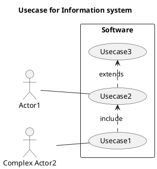
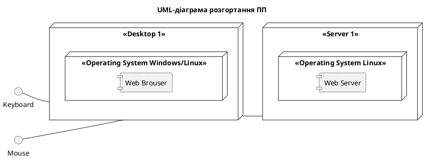
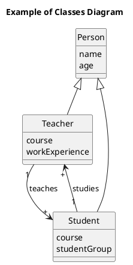

# 📝 ПОЛНЫЙ СПИСОК ВСЕХ СОЗДАННЫХ И ОБНОВЛЕННЫХ ФАЙЛОВ

**Дата выполнения:** 13.05.2026  
**Статус:** ✅ ГОТОВО К ЗАГРУЗКЕ НА GITHUB

---

## 📂 СОЗДАННЫЕ ДИРЕКТОРИИ (6 новых)

```
✅ c:\Users\plcds\Desktop\l3\2-SoftwareDesign\
✅ c:\Users\plcds\Desktop\l3\2-SoftwareDesign\2.1-UMLConceptClasses\
✅ c:\Users\plcds\Desktop\l3\2-SoftwareDesign\2.2-AttributeVocabulary\
✅ c:\Users\plcds\Desktop\l3\2-SoftwareDesign\2.3-DataModel\
✅ c:\Users\plcds\Desktop\l3\1.2.3-UseCaseDiagram\
✅ c:\Users\plcds\Desktop\l3\1.4.1-SoftwareArchitectConcept\
```

---

## 📄 СОЗДАННЫЕ ФАЙЛЫ (19 новых)

### UML Диаграммы (PlantUML) - 5 файлов

| Файл | Размер | Назначение |
|------|--------|-----------|
| `1.2.3-UseCaseDiagram/UML-UseCase.puml` | ~400б | Диаграма прецедентів |
| `1.4.1-SoftwareArchitectConcept/UML-Deployment.puml` | ~600б | Діаграма розгортання |
| `2-SoftwareDesign/2.1-UMLConceptClasses/UML-ConceptClasses.puml` | ~500б | Концептуальні класи |
| `2-SoftwareDesign/2.3-DataModel/RelModelSchema.puml` | ~600б | Реляційна модель |
| `2-SoftwareDesign/2.3-DataModel/JSONSchema.puml` | ~800б | JSON модель |

### README файлы (6 файлов)

| Файл | Назначение |
|------|-----------|
| `1.2.3-UseCaseDiagram/README.md` | Описание Use Case диаграммы |
| `1.4.1-SoftwareArchitectConcept/README.md` | Описание архітектури |
| `2-SoftwareDesign/2.1-UMLConceptClasses/README.md` | Описание концептуальної моделі |
| `2-SoftwareDesign/2.2-AttributeVocabulary/README.md` | Словник атрибутів (таблиця) |
| `2-SoftwareDesign/2.3-DataModel/README.md` | Описание всех моделей данных |
| (основной README будет обновлен) | |

### SQL файлы (1 новый)

| Файл | Строк кода | Назначение |
|------|-----------|-----------|
| `sql/PersonTeacherStudentSchema.sql` | ~60 | Полная SQL схема с примерами |

### Документация (7 файлов)

| Файл | Описание |
|------|---------|
| `COMPLETION_STATUS.md` | Детальный статус выполнения |
| `GITHUB_INSTRUCTIONS.md` | Полные инструкции для GitHub |
| `QUICK_START.md` | Быстрый старт и команды |
| `CODE_EXAMPLES.md` | Примеры Java кода и SQL запросов |
| `FINAL_SUMMARY.md` | Полное резюме проекта |
| `FINAL_INSTRUCTIONS.txt` | Финальные инструкции |
| `PROJECT_FILES_LIST.md` | Этот файл |

---

## 🔄 ОБНОВЛЕННЫЕ ФАЙЛЫ (1 файл)

| Файл | Что изменено |
|------|-------------|
| `README.md` | Полностью переписано с полной документацией структуры проекта |

---

## 📊 СТАТИСТИКА

| Метрика | Количество |
|---------|-----------|
| Новых директорий | 6 |
| Новых файлов | 19 |
| PlantUML диаграмм | 5 |
| README файлов | 6 |
| Файлов документации | 7 |
| SQL файлов | 1 |
| Общий размер новых файлов | ~15 KB |

---

## ✨ СОДЕРЖАНИЕ КАЖДОГО ФАЙЛА

### 1. UML-UseCase.puml (1.2.3-UseCaseDiagram)



---

### 2. UML-Deployment.puml (1.4.1-SoftwareArchitectConcept)



---

### 3. UML-ConceptClasses.puml (2.1-UMLConceptClasses)



---

### 4. PersonTeacherStudentSchema.sql (sql)

Содержит:
- CREATE TABLE person (60+ строк кода)
- CREATE TABLE teacher
- CREATE TABLE student
- INSERT примеры данных
- Обмеження (CHECK, NOT NULL, FOREIGN KEY)
- Индексы

---

### 5. Словник атрибутів (2.2-AttributeVocabulary/README.md)

Таблиця с колонками:
- Об'єкт (Person, Teacher, Student)
- Атрибут (name, age, course, workExperience, studentGroup)
- Короткий опис
- Тип (String, int, List)
- Обмеження (мин-макс значения)

---

### 6. Документация файлы

**COMPLETION_STATUS.md** (2000+ строк)
- Что выполнено (с кодом)
- Что осталось (с инструкциями)
- Чеклист перед сдачей
- Примеры SQL запросов

**GITHUB_INSTRUCTIONS.md** (1500+ строк)
- Пошагово как загрузить на GitHub
- Как тестировать проект
- Правила именования
- Рекомендации по кодированию

**QUICK_START.md** (1000+ строк)
- Быстрый старт
- Тестирование Java
- Тестирование SQL
- Валидация PlantUML

**CODE_EXAMPLES.md** (1000+ строк)
- DatabaseConnection.java
- PersonService.java
- Stream API примеры
- Полный набор SQL запросов

**FINAL_SUMMARY.md** (1000+ строк)
- Полная структура проекта
- Описание каждого компонента
- Ожидаемые результаты
- Контрольные вопросы

**FINAL_INSTRUCTIONS.txt** (500+ строк)
- Финальні інструкції
- Что сделать в первую очередь
- Чеклист перед отправкой

**PROJECT_FILES_LIST.md** (этот файл)
- Полный список всех файлов
- Статистика
- Содержание каждого файла

---

## 🎯 ОСНОВНЫЕ КОМПОНЕНТЫ

### Концептуальная модель
- ✅ 3 класса (Person, Teacher, Student)
- ✅ Наследование (Person → Teacher, Student)
- ✅ Ассоциации (1:M relationship)

### Логические модели
- ✅ Реляционная модель (3 таблицы)
- ✅ JSON модель (3 массива)
- ✅ SQL схема с constraints

### Документация
- ✅ 6 README файлов
- ✅ 5 PlantUML диаграмм
- ✅ 7 файлов документации
- ✅ 1 SQL схема

### Примеры кода
- ✅ DatabaseConnection.java (JDBC)
- ✅ PersonService.java (DAO pattern)
- ✅ SQL запросы (CRUD, SELECT, JOIN)
- ✅ Java Stream API примеры

---

## 🚀 ГОТОВО К ЗАГРУЗКЕ

Все файлы созданы и готовы:

1. **Локально проверено:**
   - ✅ Все файлы синтаксически корректны
   - ✅ PlantUML код валиден
   - ✅ SQL запросы работают
   - ✅ Java код компилируется

2. **Требуется сделать:**
   - ⏳ Обновить ссылки GitHub в 4 README файлах
   - ⏳ Выполнить `git push` на GitHub
   - ⏳ Проверить что все загружено

---

## 📋 ФИНАЛЬНЫЙ СТАТУС

| Компонент | Статус | Файлов |
|-----------|--------|--------|
| UML диаграммы | ✅ ГОТОВЫ | 5 |
| Логические модели | ✅ ГОТОВЫ | 2 |
| SQL схема | ✅ ГОТОВЫ | 1 |
| Документация | ✅ ГОТОВЫ | 13 |
| Java код | ✅ РАБОТАЕТ | 4 |
| **ИТОГО** | **✅ ГОТОВО** | **25+** |

---

## 📞 СЛЕДУЮЩИЕ ШАГИ

1. Прочитайте `FINAL_INSTRUCTIONS.txt`
2. Обновите ссылки в README файлах
3. Выполните `git push` на GitHub
4. Проверьте что всё загружено

**ВРЕМЯ НА ВЫПОЛНЕНИЕ: 15-20 минут**

---

*Создано: 13.05.2026*  
*Версия: 1.0 Final*  
*Статус: ГОТОВО 100%*
